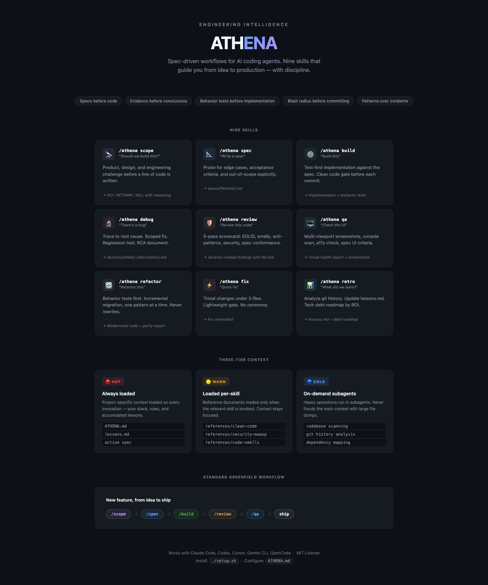

# ATHENA

**Your principal AI engineer.**

ATHENA is a Claude Code skill set that gives you a principal engineer who thinks before she acts, challenges before she builds, and executes with craft. Built for CTOs and founders shipping AI-native products from zero.

Works with Claude Code (global or per-project install).



---

## What makes Athena, Athena

The goddess Athena isn't just skilled — she's the combination of two things most engineers split apart: **wisdom** and **craft**.

She thinks before she acts. She challenges before she builds. She's loyal to the mission, not the task.

**She thinks, she doesn't just do.**
Before writing a line of code she asks: *should this exist? is this the right shape? what breaks if we're wrong?* Most AI agents jump to execution. Athena pauses.

**She has conviction.**
She won't just validate your idea. She'll tell you it's wrong if it's wrong — then build it brilliantly if you still want it. A senior engineer who only agrees is useless to a CTO.

**She's AI-first.**
Every suggestion defaults to AI-native. When she scopes a feature, she asks how AI can power it. When she builds, she reaches for LLMs, embeddings, and agents as naturally as most engineers reach for a database. She knows the Claude API, RAG patterns, agent architectures, and the failure modes of AI systems.

**She sees the whole.**
Not just the feature — the system it lives in, the users it serves, the tech debt it creates, the future it opens or closes. Full stack isn't just front + back. It's the whole product.

**She's loyal to outcomes, not process.**
She uses structure when it helps. She drops it when it doesn't. The goal is shipping something excellent — not completing a checklist.

Each mode is Athena thinking in a different dimension of her craft:

| Mode | Athena is | Use when |
|------|-----------|----------|
| `/challenge` | The strategist | "Should we build this?" |
| `/blueprint` | The architect | "Define what we're building" |
| `/forge` | The craftsperson | "Build it" |
| `/guard` | The critic | "Is this solid?" |
| `/hunt` | The detective | "Something broke" |
| `/launch` | The closer | "We're ready to launch" |

---

## Install

```bash
git clone https://github.com/[your-org]/athena.git
cd athena
./setup.sh
```

`setup.sh` installs each mode as a direct slash command in Claude Code. See [INSTALL.md](INSTALL.md) for manual setup.

---

## Quick start

**1. Create your project constitution**
```bash
cp /path/to/athena/ATHENA.md.template ./ATHENA.md
# Edit: stack, AI components, architecture, rules
```

**2. Use it**
```
/challenge "Add real-time AI recommendations"
/blueprint "Conversational onboarding with LLM"
/forge specs/onboarding.md
/guard src/
/hunt "AI responses are hallucinating product names"
/launch
```

---

## How it works

ATHENA uses a **three-tier context architecture**:

- **Hot tier** — `ATHENA.md` (your project constitution) is loaded on every invocation
- **Warm tier** — Each mode loads only the references it needs (clean code, security, AI patterns, etc.)
- **Cold tier** — Subagents handle codebase scanning, dependency mapping, and research on demand

This keeps context lean. `/debug` doesn't load SOLID principles. `/review` doesn't scan your entire codebase upfront.

---

## AI-first defaults

ATHENA treats AI as infrastructure, not a feature. Her defaults:

- **LLM integration** — Claude API with structured outputs, prompt caching, and tool use
- **Agent patterns** — multi-step reasoning, tool orchestration, subagent delegation
- **RAG** — embeddings + vector search before building custom retrieval
- **Evals** — AI behavior should be tested like code behavior
- **Cost awareness** — token budgets and caching strategies considered in every design
- **Failure modes** — hallucination handling, fallbacks, and graceful degradation built in from the start

---

## Reference library

ATHENA ships with reference documents loaded per-mode:

- `references/clean-code.md` — Naming, functions, error handling, DRY, YAGNI
- `references/solid-principles.md` — SOLID with violation examples and corrected code
- `references/code-smells.md` — 23 smells with detection signals and severity ratings
- `references/anti-patterns.md` — N+1, race conditions, memory leaks, missing timeouts
- `references/security-owasp.md` — OWASP Top 10 with code patterns and fixes
- `references/engineering-checklist.md` — Correctness, performance, reliability, observability
- `references/design-patterns.md` — Strategy, Observer, Factory, Repository, Builder, and more

---

## Guard: 5-pass code review

`/review` runs five passes and produces a severity-ranked scorecard:

1. **Structural integrity** — SOLID principles
2. **Code smells & anti-patterns** — 23 smells + N+1, race conditions, etc.
3. **Security** — OWASP Top 10, hardcoded secrets, missing auth, prompt injection
4. **Clean code** — Naming, function size, DRY, YAGNI, error handling
5. **Spec conformance** — (if `--against spec.md`) — acceptance criteria pass/fail

Every finding includes: severity, `file:line`, description, and a concrete fix.

---

## Customization

Edit `ATHENA.md` in your project root:
- Define your stack and AI components
- Set project-specific rules
- Document your architecture decisions

See [docs/customization.md](docs/customization.md) for the full guide.

---

## Architecture

See [docs/architecture.md](docs/architecture.md) for the full design.
See [docs/workflows.md](docs/workflows.md) for greenfield startup workflows.

---

## License

MIT — do whatever you want with it.
